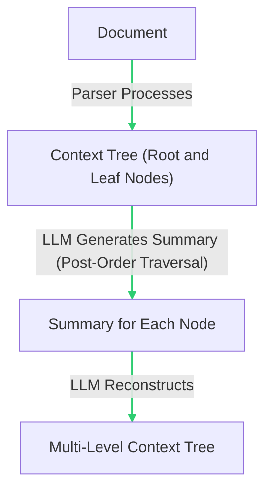
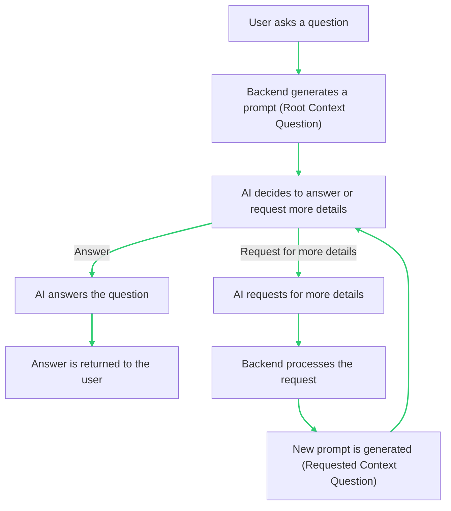

# Project: Context-Aware encoding for Large Language Models

## Introduction
The current limitation of large language models, such as ChatGPT, is their inability to accept entire documents in a single prompt, which hinders their understanding of the context and content of user-provided documents. This project aims to develop a new encoding algorithm designed specifically for large language models, allowing them to better understand and utilize the knowledge from provided documents and generate more accurate, creative solutions to real-life problems.

## Objectives
The primary objectives of this project are to:

Develop a context-aware encoding algorithm tailored for large language models.
Allow large language models to better understand and navigate user-provided documents without fine-tuning.
Improve the accuracy and relevance of knowledge retrieval by the model, enabling more precise and creative responses to user queries.
We first encode the documents in a "context tree" - a tree structure that represents the hierarchical structure of the document. We then use a hierarchical encoding algorithm to compress the document into a single prompt.
- Root node: the entire document/collection
- Parent/child nodes: each parent node contains the summarized content of its child nodes
This hierarchical encoding approach aims to create a summarized version of the entire document that can be presented in a single prompt. The model will then use this compressed version to navigate and understand the content of the document.

## Implementation

The project will be implemented in several stages:

- Pre Launch: 

    - Develop the context-aware encoding algorithm.

    - Test the algorithm with various types of documents, refining it for optimal performance.

    - Integrate the encoding algorithm with a large language model, such as ChatGPT.

    - Evaluate the performance of the integrated solution through user testing and feedback.

    - Use a database to store the encoded documents.

- Post Launch:

    - Add sematic search capabilities for more accurate knowledge retrieval.

## Expected Outcomes
The successful implementation of this project will result in a more accurate knowledge retrieval method for large language models, enabling them to have a comprehensive understanding of user-provided documents and generate more relevant and creative responses. This will significantly enhance the utility and applicability of large language models in various real-world scenarios.

## Architecture

### Encoding

1. A parser processes the document and generates a context tree, with only the root node and leaf nodes containing the original content.
2. LLM generate a summary for each node in the context tree in post-order traversal.
3. LLM reconstructs the 2-level context tree into a multi-level context tree, with each node containing the summary of its children. Leaf nodes contains the original content.

### Chatting

- User asks a question
- Backend generates a prompt containing the root context and the question
- AI decides whether to answer the question or request for more details
- If AI answers the question, the answer is returned to the user
- If AI requests for more details, the backend process the request and generate a new prompt containing the requested context and the question

