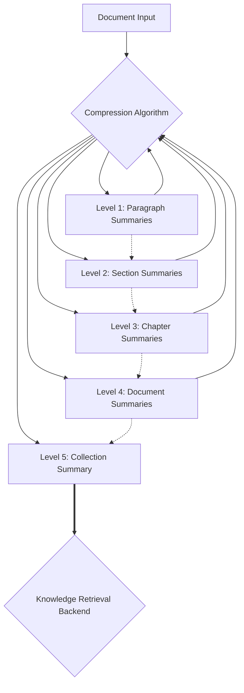
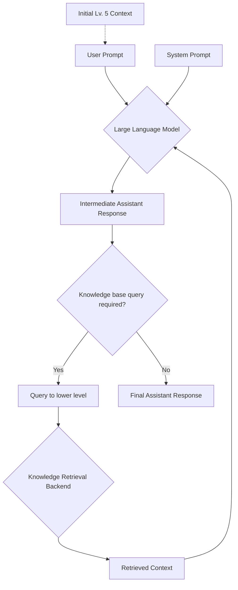

# Project: Context-Aware Compression for Large Language Models

## Introduction
The current limitation of large language models, such as ChatGPT, is their inability to accept entire documents in a single prompt, which hinders their understanding of the context and content of user-provided documents. This project aims to develop a new compression algorithm designed specifically for large language models, allowing them to better understand and utilize the knowledge from provided documents and generate more accurate, creative solutions to real-life problems.

## Objectives
The primary objectives of this project are to:

Develop a context-aware compression algorithm tailored for large language models.
Allow large language models to better understand and navigate user-provided documents without fine-tuning.
Improve the accuracy and relevance of knowledge retrieval by the model, enabling more precise and creative responses to user queries.
Methodology
The proposed compression algorithm will involve a multi-level summarization process, compressing a document at various levels of granularity. For example, considering a textbook as input, the compression process will be as follows:

- Level 1: Summarize each paragraph using large language models.

- Level 2: Summarize each section based on the paragraph summaries.

- Level 3: Summarize each chapter based on the section summaries.

- Level 4: Summarize the entire textbook based on the chapter summaries.

- Level 5: Summarize a collection of textbooks based on the textbook summaries.

This hierarchical compression approach aims to create a summarized version of the entire document that can be presented in a single prompt. The model will then use this compressed version to navigate and understand the content of the document.

## Implementation
The project will be implemented in several stages:

- Stage 1: Develop the context-aware compression algorithm.

- Stage 2: Test the algorithm with various types of documents, refining it for optimal performance.

- Stage 3: Integrate the compression algorithm with a large language model, such as ChatGPT.

- Stage 4: Evaluate the performance of the integrated solution through user testing and feedback.

## Expected Outcomes
The successful implementation of this project will result in a more accurate knowledge retrieval method for large language models, enabling them to have a comprehensive understanding of user-provided documents and generate more relevant and creative responses. This will significantly enhance the utility and applicability of large language models in various real-world scenarios.

## Architecture

### Compression

### Knowledge Retrieval

